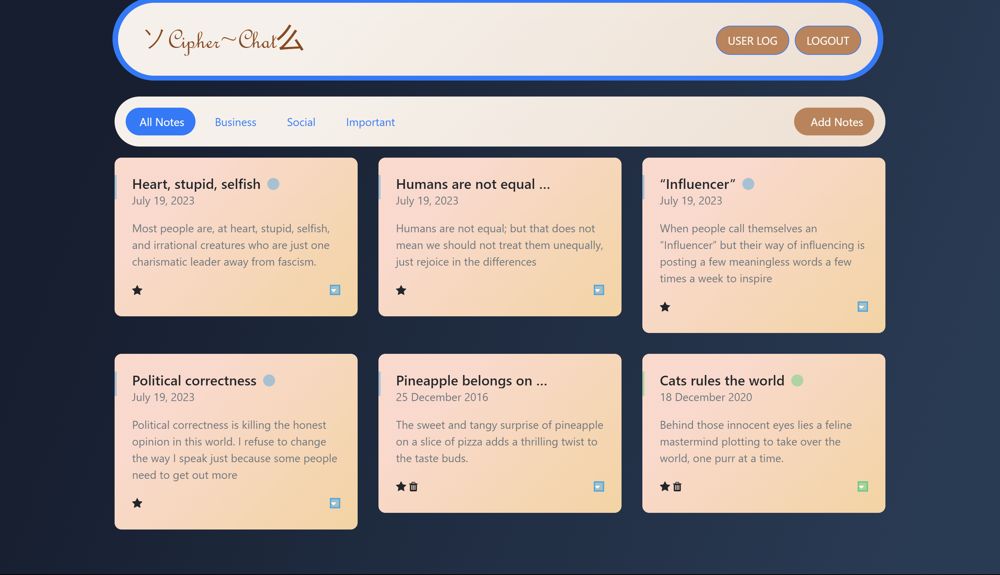

# cipherChat

Welcome to the CipherChat repository on GitHub! CipherChat is a unique messaging platform where users can share random notes securely and privately. This repository serves as the central hub for the development and maintenance of CipherChat.

Features:

● Secure Messaging: CipherChat employs advanced encryption techniques to ensure the confidentiality of your messages, allowing you to communicate with peace of mind.

● Random Note Generation: Users can create and share random notes with each other, fostering creativity and spontaneity within the community.

● User-friendly Interface: CipherChat offers an intuitive and visually appealing interface, making it easy for users to navigate and engage with the messaging platform.

● Open Source: This repository is open source, meaning that developers can contribute, review, and enhance the CipherChat codebase to create an even better messaging experience.

We encourage developers, security enthusiasts, and anyone passionate about messaging platforms to explore, contribute, and collaborate with us on the CipherChat project. Your input and contributions are highly valued as we strive to improve the security, functionality, and user experience of our platform.

Get involved today by forking this repository, submitting bug reports or feature requests, or even creating pull requests to implement new ideas. Together, let's build a vibrant and secure community where random notes can be shared with confidence. Happy messaging!

